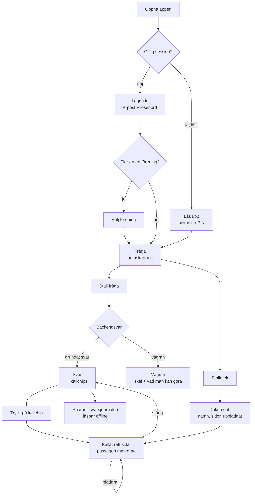
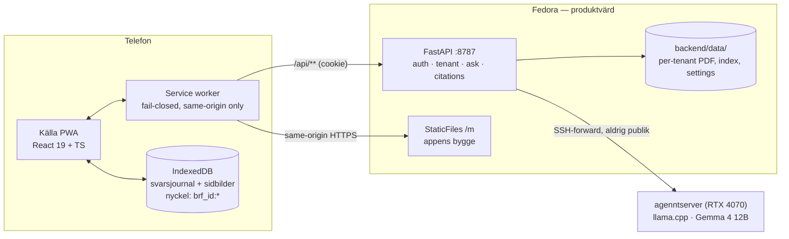
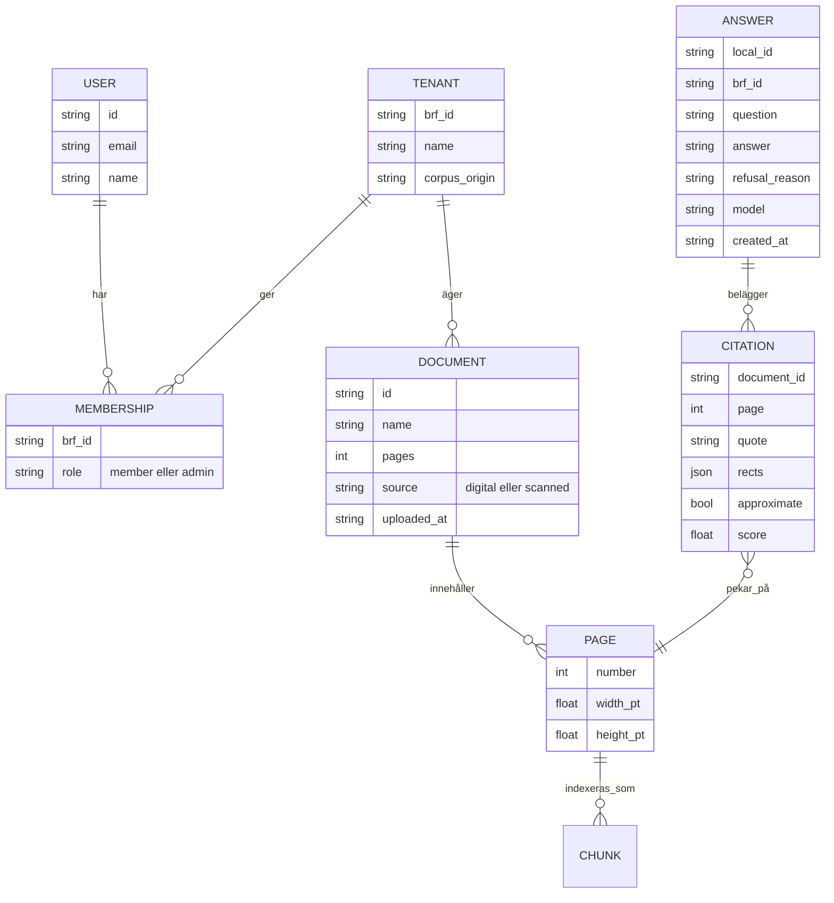

# APP BUILD BRIEF — Källa (xs_mobilapp)

**The mobile app for BRF Dokument-AI.** Working product name: **Källa**.
Repository location: `xs_mobilapp/`. Status: direction decided, not built.

> This is a decision document. Where a decision is made, it is made — not
> surveyed. Where something is deliberately not decided, it says so and names
> who decides. UI copy is quoted in Swedish because the product is Swedish;
> the brief itself follows `SPEC.md`'s precedent and is written in English.

**Baseline this builds on:** the BP6-approved pilot at `main` (`1cd65ca`).
The backend contract, tenant isolation, citation verification and refusal
behavior described in `SPEC.md` and `SPEC-PILOT.md` are **not** re-litigated
here. Källa is a new client over the existing, proven API — plus exactly one
new endpoint (§9).

---

## 1. Product vision and user value

The desktop pilot proved one thing that document-AI products usually fail at:
an answer you can defend. Every claim is tied to a verbatim passage, verified
against the source, and shown highlighted on the real page — and when the
documents cannot answer, the product refuses instead of guessing.

That proof is worth the most **away from the desk**. The board member who
needs it is standing in a stairwell with a contractor, sitting in an annual
meeting, or on the phone with a member who is upset about something in the
stadgar. Right now they either guess, or they say "jag återkommer".

**Källa is that proof in a pocket.** Ask in Swedish, get a grounded answer,
tap the source, see the exact page with the passage lit up — and hold the
phone out so the other person can see it too. That last gesture is the
product. Everything in this brief serves it.

**What Källa is not:** it is not the desktop workspace shrunk down. The
desktop app is a three-pane operator surface with settings, extraction views
and admin tooling. The phone gets one job, done completely.

---

## 2. Primary users and their jobs

**Styrelseledamot** (`member` role) — the primary and, in v1, effectively the
only user. Four to nine per BRF, non-technical, typically 45–75, on mid-range
Android and older iPhones, one-handed, often on mobile data and often in bad
light. Their jobs, in priority order:

1. **Settle it now.** "Vad står det egentligen i stadgarna om andrahands­uthyrning?" — an answer within a minute, in the room where the question was asked.
2. **Show the source.** "Var kommer det ifrån?" — open the page and point at the sentence. Without this, the answer is just another chatbot claim.
3. **Know the limits.** "Har vi ens det dokumentet?" — see the library, and get an honest refusal rather than a confident invention.

**Ordförande / admin** — same three jobs. Their extra job (adding documents
from the phone camera) is real and valuable, and is deliberately **not** in v1
(§4).

**Explicitly not a user in v1:** the BRF's residents. The auth model has
`member` and `admin` only, both of which mean *board*. Opening the corpus to
residents is a product, legal and retention decision — not a mobile decision —
and inventing a resident role here would smuggle it in.

---

## 3. Essential user journeys



The **critical path**, and the one that must feel fast and certain, is
`Fråga → Svar → Källa`. Everything else is support.

---

## 4. Scope

### In v1

- Login with the existing email/password session; local lock (biometri/PIN) over a still-valid session.
- Tenant selection when the user has more than one membership; explicit tenant switch that clears all local state.
- **Bibliotek**: the tenant's documents with page counts, upload date, digital/scanned marker.
- **Dokument**: metadata and direct page jump.
- **Fråga → Svar**: the full `POST /api/brf/{id}/ask` contract, including every refusal reason with its own honest copy.
- **Källa**: rasterized page with the verified passage highlighted, page stepper, approximate-highlight marking for scanned sources.
- **Svarsjournal**: the last 30 days of this device's answers, per tenant, readable offline.
- Provider/model provenance shown on every answer.
- Installable (home-screen), offline-capable, Swedish throughout, WCAG 2.2 AA.

### Not yet — and why

| Deferred | Reason |
|---|---|
| **Camera capture / upload / OCR ingest** | The obvious mobile-native feature, and the first thing to build next. Blocked on an OCR go/no-go: scanned ingestion is verified only as an isolated smoke (7 docs, 63 pages), not in the formal live gate (`SLUTRAPPORT` §5). Shipping capture before that gate would put unverified extraction into a real tenant. |
| **Document delete, settings, retention knobs, tenant admin** | The phone is not where anyone tunes `chunkSize` or hard-deletes a förening. Desktop keeps these. |
| **Token-for-token streaming** | XS-21, parked post-pilot. The synchronous `POST /ask` is proven sufficient; §10 specifies an honest wait state instead. |
| **Push, bevakningar, global sök, dokumentbunden chatt** | Never built, still out of scope. |
| **Resident access, self-service signup, multi-tenant SaaS onboarding** | XS-29's decision, not this app's. |
| **App Store / Play distribution** | §7 — deliberately deferred, with a named packaging path when it is actually needed. |

---

## 5. Information architecture and screens

Two destinations. Not three, and not a hamburger.

```
┌─ Header ─────────────────────────────┐
│  Brf Gjutformen 12        ⟨avatar⟩   │   avatar → Konto
├──────────────────────────────────────┤
│                                      │
│   [ Fråga ]            [ Bibliotek ] │   bottom bar, 2 items
└──────────────────────────────────────┘
```

| Screen | Route | Purpose | Reached from |
|---|---|---|---|
| Logga in | `/login` | email + password | cold start, 401 |
| Välj förening | `/valj` | only when `memberships.length > 1` | after login, Konto |
| **Fråga** | `/` | question composer + recent answers | bottom bar |
| **Svar** | `/svar/:localId` | answer, citations, provenance | asking, journal |
| **Källa** | modal sheet over `/svar/:localId` | page image + highlight | citation chip, Dokument |
| **Bibliotek** | `/bibliotek` | document list | bottom bar |
| **Dokument** | `/dokument/:id` | metadata, page jump | Bibliotek |
| Konto | `/konto` | user, förening, provider status, logga ut | avatar |

**Navigation rules.** Svar is a push, not a tab — asking a new question from
Fråga replaces nothing; the previous answer stays in the journal. Källa is a
full-height sheet, because the user is *inside* the answer, not leaving it;
dismissing returns to Svar with scroll position intact and the just-opened
citation chip marked as visited. Back always means back; there is no
navigation state the OS back gesture cannot undo.

---

## 6. Interaction and visual direction

### The governing idea

The thing the user is looking at is **a white page from a real document**.
The desktop app wraps that in a dark operator workspace, which on a phone
becomes a glare sandwich: bright page, black chrome, bright page. So Källa is
**light-first and paper-forward** — warm paper ground, ink text, hairline
structure, and exactly one accent. The interface should read as a document
tool, not as a chat app.

Dark mode is supported and dims the *chrome only*. **The page image is never
inverted or recolored.** It is legal and financial source material; altering
its appearance would undermine the one thing the product sells.

### Tokens

```css
/* Ground */
--paper:        #FBFAF8;   /* app background — warm, not sterile */
--surface:      #FFFFFF;   /* cards, sheets, the page itself */
--hairline:     #E6E3DE;
--hairline-str: #D3CEC6;

/* Ink */
--ink:          #14161A;   /* body, answers */
--ink-2:        #4A5058;   /* secondary */
--ink-3:        #767D87;   /* meta, timestamps */

/* One accent */
--action:       #1F4FD8;   /* buttons, links, focus */
--action-press: #1740B0;

/* Meaning */
--grounded:     #0E7C5A;   /* verified citation */
--refusal:      #9A6400;   /* a refusal is CORRECT behavior, not an error */
--error:        #B3261E;   /* network, auth, provider down — actual failures */

/* The highlighter */
--hl-fill:      rgba(255, 214, 0, 0.38);
--hl-edge:      #C9A227;

/* Dark mode: chrome only */
--paper-dark:   #16181C;
--surface-dark: #1E2126;
--ink-dark:     #ECEDEF;
/* --surface for the page image stays #FFFFFF in both themes */
```

**Refusal is amber, never red.** When the product refuses, it is working
exactly as designed. Red is reserved for things that are genuinely broken —
no network, expired session, model unreachable. Getting this wrong teaches
users that the product is unreliable when it is being trustworthy.

### Type

System stack (`-apple-system, "Segoe UI", Roboto, sans-serif`) — deliberate:
no webfont on the critical path, native Swedish rendering, and it inherits
the user's dynamic-type setting for free.

| Role | Size / line-height | Weight |
|---|---|---|
| Answer body | 19 / 1.5 | 400 |
| Screen title | 24 / 1.25 | 620 |
| Section label | 12 / 1.2, `.06em` tracking, uppercase | 600 |
| Body | 16 / 1.45 | 400 |
| Quote (in citation chip) | 15 / 1.4, italic | 400 |
| Meta | 13 / 1.35 | 450 |

The answer is set larger than the chrome. It is the thing being read aloud
and shown to someone else across a table.

### Shape, elevation, motion

- Radius 12 on cards, 999 on chips, **0 on the page image** — paper has corners.
- Structure comes from hairlines and background steps. The only drop shadow in the app is the Källa sheet lifting off the answer.
- Push 180 ms `cubic-bezier(.2,0,0,1)`; sheet 240 ms.
- The highlight **fades in over 400 ms, 120 ms after the page image paints**, so the eye lands on the passage instead of hunting for it. This is the single most important animation in the product.
- All of the above collapses to instant under `prefers-reduced-motion`.
- Minimum touch target 44×44 px. The composer is thumb-anchored to the bottom, above the safe area.

### Signature components

**Question composer** — a single growing textarea pinned above the bottom
bar, placeholder `"Fråga om föreningens dokument…"`, with a send button that
is disabled-with-reason rather than mysteriously inert (offline → `"Offline"`;
empty → hidden). It never obscures the last answer.

**Answer card** — the answer text, then a thin `--grounded` rule, then the
citation chips, then a single meta line:
`"Gemma 4 12B (självhostad) · 14:32"`. No avatars, no bubbles, no typing
dots. This is a document tool.

**Citation chip** — a real `<button>`, full-width, left-aligned:

```
┌────────────────────────────────────────┐
│ ✓  Stadgar · sida 4                    │
│    "Andrahandsuthyrning kräver styrel-│
│     sens skriftliga samtycke."         │
└────────────────────────────────────────┘
```

Check glyph in `--grounded` for a verified citation; a dashed left edge plus
the label `"ungefärlig markering"` when `approximate: true`. Never colour
alone.

**Källa sheet** — document name and page in the header, a quote bar stating
the verified quote and whether the match is exact, the page image with
highlight overlays, and a page stepper (`‹ 4 / 17 ›`).

It opens **framed on the passage, not on the page**: zoomed so the cited line
is legible and scrolled so it is on screen, with a `Hela sidan` / `Visa
passagen` toggle. *(This overrides the original "do not build a custom zoom"
instruction. Running the app settled it: an A4 page fitted to a 320px phone
renders 10pt body text at about five pixels. The highlight was visible and
the words were not — which fails the exact moment the product exists for.
Native pinch-zoom is still available on top; it just cannot be the answer,
because it requires the user to hunt and pinch while someone waits.)*

Leaving the cited page drops the highlight and shows
`"Markeringen finns på sida 4"` with a tap-to-return.

### States — all of them

| State | Treatment | Copy (verbatim) |
|---|---|---|
| Tomt bibliotek | Illustration-free, one line + admin hint | `"Föreningen har inga dokument ännu."` |
| Ställer fråga | Two-stage, honest, no fake progress bar | `"Söker i 5 dokument…"` → after retrieval `"Formulerar svar…"` |
| Grundat svar | Answer card | — |
| Vägran: `no_documents` | Amber card | `"Föreningen har inga dokument att söka i."` |
| Vägran: `low_relevance` | Amber card | `"Ingen passage i era dokument matchar frågan tillräckligt väl."` |
| Vägran: `insufficient_data` | Amber card | `"Dokumenten innehåller inte svaret på den här frågan."` |
| Vägran: `grounding_failed` | Amber card | `"Ett svar togs fram men kunde inte beläggas i era dokument, så det visas inte."` |
| Vägran: `numeric_grounding_failed` | Amber card | `"Svaret innehöll en siffra som inte gick att belägga i den citerade texten, så det visas inte."` |
| `provider_error` | Red card, retry | `"Modelltjänsten svarar inte just nu."` |
| Offline | Persistent header strip, composer disabled | `"Du är offline. Frågor kräver uppkoppling."` |
| Session utgången | Full-screen, returns to the same question | `"Din session har gått ut. Logga in igen."` |
| Sidbild laddar | Skeleton at the true page aspect ratio (from `/extraction`) — never a jumping layout | — |

Every refusal card carries the same closing line in `--ink-3`:
**`"Inget svar visas utan belägg."`** It appears often enough to become a
promise.

`rejected_citations` are diagnostics, not user content. They live behind a
`"Varför visas inget svar?"` disclosure on refusal cards, never in the main
flow.

### Responsive behavior

- **320–430 px portrait** — the design target. Single column.
- **Landscape phone** — the Källa sheet becomes full-bleed; chrome collapses to a floating back button.
- **≥ 720 px (tablet)** — two panes: answer left, source right, permanently open. Same components, no new screens. This deliberately converges on the desktop mental model rather than inventing a third one.

---

## 7. Implementation stack and architecture

### Decision: a mobile-first installable web app (PWA), same origin as the API

**React 19 + TypeScript + Vite**, no UI framework, no state library, no
router library beyond a ~50-line hash/history router. Hand-written service
worker. `idb-keyval` for the local journal and image cache. That is the whole
dependency list.

Three alternatives were genuinely on the table; here is why they lost.

- **React Native / Expo.** Rejected. It forces a second implementation of the PDF-page-plus-overlay surface — the one thing the product must never get wrong — and it replaces the existing `httpOnly` cookie session with a bearer token that must then be stored on the device. It also needs Xcode/Android Studio, signing, and EAS or equivalent, which a single-developer, self-hosted, one-tenant pilot with no store presence has no path to. The cost is real; the benefit (camera, push) is entirely in the deferred scope.
- **Wrapping it in a native shell now (Capacitor/Tauri).** Rejected *for now*, not forever. The PWA **is** the shell's content, so wrapping later costs approximately nothing. When store distribution or native camera actually becomes a requirement, the sibling project *brfv2 Desktop — Fedora app shell* has already chosen **Tauri 2**, which targets iOS and Android from the same shell — so that is the packaging path, and it should be the packaging path, rather than introducing a second shell technology.
- **Making `brfv2-mockup/` responsive.** Rejected. It is a 1 484-line three-pane operator workspace. Squeezing a phone into it yields a bad phone app and a compromised desktop app.

**Consequences of same-origin, stated plainly:** the existing `brf_session`
cookie works untouched, no token ever reaches JavaScript, no CORS entry is
added in production, and `Content-Security-Policy: default-src 'self'` is
achievable with no exceptions. In dev the app runs on `:5174`, which is the
one CORS allowlist addition required.

### Decision: server-rasterized page images, not pdf.js

This is the most consequential technical call in the brief.

The desktop renders PDFs with pdf.js and computes overlays through the pdf.js
viewport transform (`PdfPane.jsx:82–98`) — including a y-flip, because pdf.js
works in y-**up** user space while the backend emits top-left-origin points.
On mobile that means a >1 MB worker, canvas memory pressure on 3–4 GB Android
devices, and megabyte PDF downloads that are useless for offline caching.

Instead, the backend rasterizes a page and the client draws rects on an
``. The backend already depends on PyMuPDF and already rasterizes pages
in the OCR rig, and `/extraction` **already returns each page's `width` and
`height` in points** (`store.py:387–389`). So the whole transform collapses
to:

```ts
const scale = imageWidthPx / pageWidthPt;      // from /extraction
const style = {
  left:   x0 * scale,
  top:    y0 * scale,          // rects are ALREADY top-left origin
  width:  (x1 - x0) * scale,
  height: (y1 - y0) * scale,
};
```

**No y-flip. No viewport matrix. No rotation handling in the client** — the
rasterizer applies page rotation, so the image and the points share one
coordinate space. Fewer moving parts than the desktop, and far easier to
prove correct. It also makes a page an ~80 KB WebP that offline caching can
actually hold.

### Architecture



The mobile app adds **no new trust boundary**. It talks to the same
tenant-scoped API with the same session cookie, and the GPU stays where it
is.

---

## 8. Core data model and service boundaries



### Boundaries — who owns what

**The mobile app owns no truth.** Documents, pages, chunks, indexes,
settings, memberships and every verification decision live behind the
tenant-scoped API and are never recomputed, cached-as-authoritative, or
second-guessed on the device. In particular the client **never** decides
whether a citation is valid — it renders what the backend verified.

The client owns exactly two things, both derived and both disposable:

| Client-owned | Contents | Lifetime |
|---|---|---|
| **Svarsjournal** (IndexedDB) | question, answer text, refusal reason, citations, model, timestamp | 30 days rolling; user-clearable; **wiped on logout and on tenant switch** |
| **Sidbildscache** (Cache API) | rasterized page images | LRU, 60 MB cap; **wiped on logout and on tenant switch** |

**Isolation rule — non-negotiable.** Every cache key and every IDB record is
prefixed with `brf_id`. Logout and tenant switch must `caches.delete()` the
image cache and clear the journal store before the next screen renders. The
backend's adversarial isolation suite proves BRF A can never reach BRF B's
content; a shared or un-namespaced client cache would reintroduce exactly the
leak that suite exists to prevent. Treat this as a security requirement, not
a hygiene nicety — §11 requires a test for it.

---

## 9. Required backend change (exactly one)

Everything else in v1 runs on the existing API. Only page rasterization is new.

```
GET /api/brf/{brf_id}/documents/{doc_id}/page/{page}?w={720|1080|1440}
```

- **Auth:** the same `tenant_store` dependency as every other tenant route — a non-member gets **404, never 403**, preserving the no-existence-probe property (`main.py:97–104`).
- **Response:** `image/png`, page rendered by PyMuPDF at the requested pixel width with page rotation applied. *(Was specified as WebP. PyMuPDF cannot emit WebP at all, and measured on the seeded corpus PNG came in at 58/95/122 kB for 720/1080/1440 — smaller than `jpg_quality=85` at 1440 and lossless, which is what a document being held up as proof deserves.)*
- **Width allowlist is closed** — `720 | 1080 | 1440` only. An open `w` parameter is a rasterization DoS.
- **Headers:** `X-Page-Width-Pt`, `X-Page-Height-Pt` (cross-check against `/extraction`), and `Cache-Control: private, no-store`. *(The brief said `immutable, max-age=1y`, and the bytes genuinely are immutable — but they are tenant document content, and the browser's HTTP cache is not something the app's logout can clear. That copy would outlive a session on a shared device, outside the tenant-namespaced client store the whole wipe guarantee rests on. The client caches these itself, so `no-store` costs nothing.)*
- **404** for unknown document or out-of-range page.
- **Rendered on demand, never cached to disk.** *(The brief called for a disk cache under the tenant directory. Measured render time is 4–6 ms, so the cache buys almost nothing and costs a second place tenant content lives — one every future deletion path would have to remember to sweep. Immutable HTTP caching plus the client's own tenant-namespaced store covers the repeat cost with none of that risk.)*

Ship this with the same class of test the rest of the backend has: a
cross-tenant access test, a page-out-of-range test, a width-rejection test,
and a test asserting the rasterized pixel dimensions match
`X-Page-Width-Pt × scale`.

---

## 10. Security, privacy, accessibility, performance, offline

**Security.** Same-origin only, and enforced rather than assumed: the backend
serves `/m` with `default-src 'self'`, `script-src 'self'` (no
`unsafe-inline`, no `unsafe-eval`), `connect-src 'self'`, `object-src 'none'`,
`base-uri 'none'` and `frame-ancestors 'none'`, plus `nosniff`,
`Referrer-Policy: no-referrer` and `X-Frame-Options: DENY`. The single
exception is `style-src 'unsafe-inline'`, which React's `style={{…}}`
attributes require. No CDN, no analytics, no fonts, no error reporting.

The service worker **fails closed** on any cross-origin request and never
touches `/api`, so no tenant content lives in Cache Storage; a cross-origin
fetch in this app is a bug or an attack, never a feature. Session stays in
the existing `httpOnly` cookie; no token ever touches JavaScript or
`localStorage`.

The biometric/PIN lock is a **local UI lock over a still-valid server
session** — it re-opens the app, it does not re-authenticate to the backend.
Say so in the code comment where it is implemented, so nobody later mistakes
it for an auth boundary.

**Privacy.** The journal contains verbatim text from real BRF documents, so
it is personal data on the device: 30-day rolling retention, a visible
"Rensa svarshistorik" control in Konto, and an unconditional wipe on logout.
Web apps cannot blur themselves in the OS app switcher — that is an accepted
limitation, recorded here rather than papered over. Ownership of this data
falls under the same open TBD as `SLUTRAPPORT` §6 (§13).

**Accessibility — WCAG 2.2 AA.**
- The page image's `alt` is **the verified quote**, not "PDF-sida". The highlight is decorative (`aria-hidden`); the quote is what a screen reader user actually needs.
- Citation chips are real buttons with accessible names including document and page: `"Källa: Stadgar, sida 4"`.
- Nothing is signalled by colour alone — verified carries a glyph, approximate carries a dashed edge and a text label.
- Dynamic type to 200 % without clipping or horizontal scroll; the answer card and citation chips must reflow, not truncate.
- Visible focus everywhere, logical order, the Källa sheet traps focus and returns it to the originating chip on dismiss.
- Verify `--refusal` amber on `--paper` and `--hl-edge` on white during the a11y pass; adjust the token, not the rule.

**Performance budgets** (enforced in CI, §11):
| Budget | Target |
|---|---|
| JS, gzipped | ≤ 120 KB (dropping pdf.js is what buys this) |
| First contentful paint, mid-range Android over 4G | < 1.5 s |
| Page image, warm cache | < 400 ms |
| Page image, cold | < 1.2 s |
| Highlight visible after page paint | ≤ 520 ms |

Answer latency is model-bound on a self-hosted 12B and cannot be budgeted
away. The UI is therefore **honest** about it: staged wait copy (§6), no fake
progress, and a client timeout that is strictly longer than the backend's so
the app never abandons a request the server is still answering.

**Offline.** Readable offline: the library list, document metadata, every
page image already viewed, and the full journal. Not possible offline:
asking. The composer disables with a clear reason.

**Questions are never queued for later.** An answer generated hours later,
against a corpus that may have changed, delivered without the user present to
read the refusal — that is a grounding hazard, and it contradicts the
product's core promise. Say no, visibly, instead.

---

## 11. Testing and delivery

**Unit (Vitest).** The rect→CSS transform against golden fixtures taken from
the backend's own eval output; refusal-reason→copy mapping (a missing case
must fail the build, not render an empty card); cache-key namespacing.

**Acceptance (Playwright, mobile emulation — Pixel 7 and iPhone 14
viewports)** against a real backend with the scripted LLM, mirroring
`brfv2-mockup/e2e`. Auth, tenant scoping, storage, retrieval, citation
shaping, the page endpoint and highlight placement are all real; only
generation is deterministic. Required assertions:

1. Login → ask → grounded answer rendered with ≥ 1 citation chip.
2. Tap chip → Källa opens on the **cited** document and page.
3. A highlight element exists and its box is within tolerance of the expected rect at all three allowed widths.
4. An unanswerable question renders the correct refusal card and **no** answer text.
5. A scanned source renders the approximate treatment and its label.
6. Offline: composer disabled with the offline reason; a previously viewed page still renders.
7. **Isolation:** log in as A, view a page, log out, log in as B → A's page image and journal entries are gone from the cache and unreachable. This test may not be skipped.

**Accessibility.** axe in the Playwright run, plus a scripted manual
VoiceOver/TalkBack pass over `Fråga → Svar → Källa` before the app is shown
to a real board.

**Delivery.** `npm run build` emits static assets that FastAPI serves at
`/m` via `StaticFiles`, so the app and the API share an origin. A
`make mobile-dev` target sits alongside `make demo`. No store, no CDN, no
external host, no new external dependency — the repo stays runnable from a
clean checkout, which `ERFARENHETSATERFORING` rule 1 exists to protect.

---

## 12. Implementation sequence

Each phase ends in something demonstrable. Phases 1–4 are the product;
5–6 make it trustworthy.

| # | Phase | Ends when |
|---|---|---|
| **0** | **Feasibility spike** — the page endpoint (§9) plus a throwaway HTML page drawing citation rects on the rasterized image | A citation lands on the right words for one digital and one scanned document, at all three widths. **This is the only real unknown in the brief; do it first and do not proceed until it is green.** |
| **1** | Shell — build setup, router, tokens, header/bottom bar, login, tenant select, session lock, offline strip | You can log in, land on Fråga, and the app installs to a home screen |
| **2** | Bibliotek + Dokument on the real API, with skeletons at true page aspect ratio | The library is browsable and reflects the tenant |
| **3** | Fråga → Svar, every refusal state, provenance line | The product is genuinely useful — a board member could use this |
| **4** | Källa sheet: page image, highlight, stepper, approximate treatment, two-pane at ≥ 720 px | The proof lands. This is the demo moment |
| **5** | Journal, offline cache, and the wipe-on-logout/switch isolation behavior | Answers survive a restart; A's data cannot outlive A's session |
| **6** | A11y pass, performance budgets in CI, full Playwright acceptance, install polish (manifest, icons, splash) | Green, and shippable to a real board |

Phase 3 is the earliest point worth putting in front of a real board member;
phase 4 is the earliest point worth calling it Källa.

---

## 13. Open decisions — Simon's, not the implementer's

These do not block the build. They block deployment to a real board, and
they are named here rather than assumed.

1. **Who owns the on-device answer journal as personal data.** Same open ownership TBD as `SLUTRAPPORT` §6. Until answered, run the pilot on Simon's own devices only.
2. **Whether Källa is ever reachable beyond LAN/SSH-forward.** The pilot never made a public-hosting decision. A phone that leaves the flat needs a real origin and TLS, which is a deployment decision with its own gate — not something to slip in during phase 1.
3. **The OCR go/no-go.** It gates camera capture (§4), which is the natural next phase after this one.

---

## 14. Changed during implementation

The brief was built. These decisions moved because building produced better
evidence than the guess did — recorded here so the document and the code do
not drift apart.

| Decision | Brief said | Built as | Why |
|---|---|---|---|
| Raster format | WebP, JPEG fallback | **PNG** | PyMuPDF cannot emit WebP. PNG measured 58/95/122 kB at the three widths — smaller than JPEG q85 at 1440, and lossless. |
| Raster caching | disk cache under the tenant dir | **none, rendered on demand** | 4–6 ms per render. A disk cache would be a second home for tenant content outside the existing delete paths. |
| Page bytes on device | Blob in IndexedDB | **ArrayBuffer + type** | Blob-in-IDB has a patchier structured-clone history, and is unclonable under jsdom — which would have left the isolation tests unable to inspect what they assert. |
| Device lock | biometrics (WebAuthn) or PIN | **PIN only** | WebAuthn adds a credential lifecycle for something that is explicitly not an auth boundary. The PIN is hidden entirely when WebCrypto is unavailable rather than pretending to work. |
| `--ink-3` meta colour | `#767d87` | **`#626a75`** | Measured 4.16:1 on white — under the 4.5:1 floor. axe caught it; the token was wrong, not the rule. |
| Serving `/m` | `StaticFiles` mount | **explicit route** | `StaticFiles` 404s unknown paths; the client routes `/svar/:id` itself, so a deep link needs an index.html fallback and a containment check. |
| Source view zoom | "do not build a custom zoom" | **passage framing** (§6) | Measured in the running app: an A4 page at 320px renders body text at ~5px. Visible highlight, unreadable words — the failure mode the product cannot have. |
| Two-pane breakpoint | `min-width: 720px` | **`min-width: 720px` and `min-height: 600px`** | A landscape phone is >720px wide with no room for two columns; splitting there produced a clipped answer beside a cropped page. |
| Two-pane behavior | sheet over the answer | **frame reflows beside the sheet** | Overlaying meant "two panes" was really one pane with the other covered up. |
| Page-image caching | `immutable`, 1 year | **`no-store`** | The HTTP cache is outside anything logout can clear — a second copy of one user's documents surviving their session on a shared device. |
| Session expiry | drop to login | **drop to login *and* wipe** | Expiry is the session ending; the device should not keep the previous session's answers for whoever signs in next. |
| Code lock lifetime | not specified | **cleared on logout** | Otherwise the next person to sign in is locked out of their own account by a code only the previous user knows. |
| Service-worker cache name | fixed string | **carries the release version** | A static `sw.js` never changes bytes, so the browser never treated it as updated and the activate-time cleanup was dead code. |

Unchanged and worth restating: no pdf.js, no y-flip, PWA over React Native,
two tab destinations, refusal-is-amber, and the tenant-namespaced wipe.

## 15. What an implementing agent must not re-decide

- The backend contract, refusal semantics, and citation verification. They are proven; render them, do not reinterpret them.
- Rects are **top-left-origin PDF points**. There is no y-flip in this app.
- Refusal is amber. Errors are red.
- The page image is never inverted, recolored, or restyled.
- Cache keys are `brf_id`-prefixed, and logout wipes them.
- No cross-origin request, ever.
